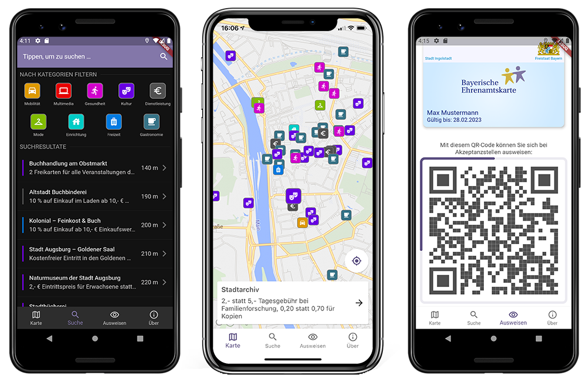

# Digitale Ehrenamtskarte

> App for the 'Bayerische Ehrenamtskarte', a benefit card for volunteers in Bavaria, Germany.
>
> App for Android & iOS + Backend + Administration Web Portal - **100% Open Source**.

English | [Deutsch](docs/de/readme.md)

## Getting Started

* [Setup documentation](./docs/development-setup.md)

## Documentation

* [Staging Setup](./docs/staging-setup.md)
* [Production Setup](./docs/production-setup.md)
* [GraphQL Code Generation](./docs/graphql_generation.md)
* [Protobuf Code Generation](./docs/protobuf-generation.md)
* [Generate EAK Regions](./docs/creating_participating_regions.md)

## What is a _Ehrenamtskarte_?

Short answer: a benefit card for volunteers in Bavaria, Germany.

Translated from [Wikipedia](https://de.wikipedia.org/wiki/Ehrenamtskarte):

>The Ehrenamtskarte (also Ehrenamtspass) is a personal document in Germany that serves as proof of special 
> voluntary commitment. Such a document can be issued, for example, by the state, federal states, 
> municipalities or volunteer agencies.
>
> Depending on how it is implemented, it may be linked to documentation of the type and scope of the activity, 
> the skills required for it and any qualification measures. An Ehrenamtskarte or Freiwilligenausweis can also bring 
> certain benefits, such as discounts on tickets or access to museums or other public institutions, or benefits 
> with cooperation partners, such as companies, institutions and other supporters.

## Features

**This project consists of the following components:**

- A mobile app for Android and iOS in the folder `frontend`. [Flutter](https://flutter.dev/) was used to implement the app.
  The app offers the following functions:
    - Display of accepting stores from different categories with different symbols on a map.
    - Display details of an accepting store with descriptive text, address, phone number, email address and website.
    - A page to browse accepting stores with optional sorting by distance from the current location.
    - An ID function for a digital volunteer card.
    - A reliable way to verify another digital volunteer cards.
    - An application form for a new volunteer card.
- A `backend` implemented in Kotlin (JVM) that is responsible for the management of all accruing data.
    - Interfaces for the app: retrieving accepting stores, verifying digital volunteer cards and receiving applications.
    - Interface for the administration web portal: Entering new digital volunteer cards and querying applications.
- A web portal for the administration of digital volunteer cards, implemented with [React](https://reactjs.org/) in the folder `administration`.
- A Postgres or [PostGIS](https://postgis.net/) database to store the accepting stores, as well as the digital volunteer cards and applications.
- [Martin](https://github.com/urbica/martin), for queries to display accepting stores on the map.

## Demo Video (German)

Click [here](https://youtu.be/YsEAVG6efVU ) to view the video.

## Resources about the Ehrenamtskarte

See [here](https://github.com/digitalfabrik/ehrenamtskarte-artefacts)

## About the project

This project was created by 6 students of the [Software Engineering Master's programme](https://elite-se.informatik.uni-augsburg.de/) of Universität Augsburg,
TU München und LMU München.

We were supported by [Tür an Tür – Digitalfabrik gGmbH](https://tuerantuer.de/digitalfabrik/) in our cooperation 
with the _Bayerisches Staatsministerium für Familie, Arbeit und Soziales_ (Bavarian State Ministry for Family, Labour and Social Affairs).

## Conventions

- [Conventions](./docs/conventions.md)
