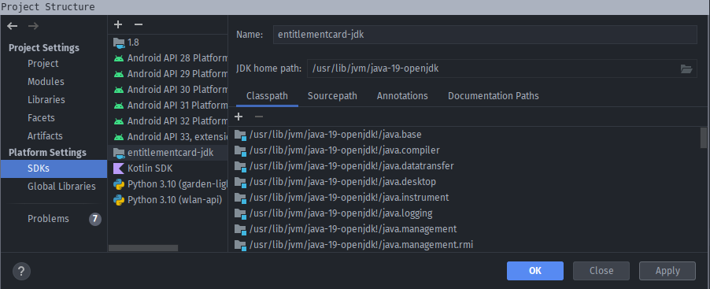

# Development Setup

## Contents

- [Development Setup](#development-setup)
  - [Contents](#contents)
  - [Prerequisites](#prerequisites)
  - [Frontend](#frontend)
    - [Frontend Setup](#frontend-setup)
    - [Run Frontend](#run-frontend)
  - [Administration](#administration)
    - [Administration Setup](#administration-setup)
    - [Run Administration](#run-administration)
    - [Run e2e-tests for Administration](#run-e2e-tests-for-administration)
  - [Backend](#backend)
    - [Recommended IDE set up](#recommended-ide-set-up)
    - [Common development tasks](#common-development-tasks)
    - [Backend Setup](#backend-setup)
    - [Run Backend](#run-backend)
    - [Optional Backend Setup](#optional-backend-setup)
      - [Local Backend Configuration](#local-backend-configuration)
      - [Map Styles](#map-styles)
      - [Matomo](#matomo)
      - [Inspecting Services](#inspecting-services)
    - [DB tasks](#db-tasks)
    - [Using ehrenamtskarte.app as Database](#using-ehrenamtskarteapp-as-database)

## Prerequisites

- **JDK 25**: for running the backend and the Android version of the frontend. We use [Eclipse Temurin](https://adoptium.net/de/temurin/releases), but others _might_ work as well.
- **[fvm](https://fvm.app/documentation/getting-started/installation) >= 4.0.1**: managing Dart and Flutter versions.
- **[Node.js](https://nodejs.org/en/) >= 24.x.x**: to develop the administration web application.
- One of:
  - **[Docker](https://docs.docker.com/get-docker/) >= 4.5.0**: for running the various backend services.
  - **[Podman](https://podman.io/getting-started/installation) >= 5.6.2** (experimental).
- For developing and building the iOS version of the mobile app (macOS required):
  - **[brew](https://formulae.brew.sh/)** package manager for macOS. Optional but highly recommended. 
  - **[XCode](https://apps.apple.com/de/app/xcode/id497799835?mt=12) >= 16.4**
  - **[Ruby](https://www.ruby-lang.org/en/downloads/) >= 3.4.7**
  - **[Bundler](https://bundler.io/) >= 2.7**: for installing cocoapods and other dependencies.
  - **[cocoapods](https://cocoapods.org/) >= 1.16.2**: for installing the iOS dependencies.
- For developing and building the Android version of the mobile app:

  One of: 
  - **[Android Studio](https://developer.android.com/studio) >= 2025.2.1**
  - **[Android plugin](https://plugins.jetbrains.com/plugin/22989-android)**  for IntelliJ

Recommended IDEs:
- **[IntelliJ Community Edition](https://www.jetbrains.com/de-de/idea/)**, with the following plugins:
  - [Dart](https://plugins.jetbrains.com/plugin/6351-dart/versions)
  - [Flutter](https://plugins.jetbrains.com/plugin/9212-flutter)
  - [Prettier](https://plugins.jetbrains.com/plugin/10456-prettier) (compatible with IDEA Ultimate only)
  - [Ktlint](https://plugins.jetbrains.com/plugin/15057-ktlint)
- **[VS Code](https://code.visualstudio.com/)**: currently only useful for the administration web application and Flutter mobile app (very basic support at the moment).


## Auxiliary Services

> [!NOTE]: all commands here are meant to be executed in the project root directory.
 
If you want to develop or test against a local backend, you need to start some auxiliary services. You can either use the open-source Podman/Podman Compose or classic Docker/Docker Compose.  

- When using Podman, initialize and start the machine:
    ```shell
    podman machine init
    podman machine start
    ```

- Start auxiliary backend services:
  - When using Podman: `podman compose up -d`
  - When using Docker: `docker compose up -d`


## Frontend

> [!NOTE]: all commands here are meant to be executed in the `/frontend` directory.

### Frontend Setup

- Install flutter dependencies: `fvm flutter pub get`
- When using IntelliJ, open the settings and
   - Install the Dart plugin and set the Dart SDK path
   - Install the Flutter plugin and set the Flutter SDK path

    *Note: IntelliJ needs access to environment variables to run these commands successfully.*

#### Android

- When using IntelliJ, install the Android plugin.
- Install the Android SDK.
- Set the Android SDK path in the IntelliJ settings.

#### iOS

- Install gems: `cd ios && bundle install`
- Install cocoapods: `cd ios && bundle exec pod install --repo-update`
- *Optional*: install cocoapods globally (only necessary if using IntelliJ run configurations to run on iOS): `brew install cocoapods`

### Run Frontend

1. Forward ports. As there are several services running and interacting, some ports need to be forwarded.
This includes the backend port 8000 and the map tiles port at 5002.
The command has to be run every time a device is connected.

```shell
adb reverse tcp:8081 tcp:8081 && adb reverse tcp:8000 tcp:8000 && adb reverse tcp:5002 tcp:5002
```

2. Run the app 
   - Bayern: `Run (env:local+buildConfig:bayern)`
   - Nuernberg: `Run (env:local+buildConfig:nuernberg)`
   - Koblenz: `Run (env:local+buildConfig:koblenz)`


## Administration

> [!NOTE]: all commands here are meant to be executed in the `/administration` directory.

### Setup

Install Node.js dependencies: `npm install`

### Run Administration

- With the IntelliJ run configuration: run `Start administration (env:local+buildConfig:all)`.
- With a shell: `npm run start`

### Run e2e-tests for Administration

1. Run [backend](#run-backend) and start the [administration](#run-administration).
2. install supported browsers for [Playwright](https://playwright.dev/docs/browsers#install-browsers): `npx playwright install`
3. Run Playwright tests:
   - All tests: `npm run test:e2e`
   - You can run individual tests by `npm run test:e2e [file name]`


## Backend

> [!NOTE]: all commands here are meant to be executed in the `/backend` directory. 


### Recommended IDE set up

For IntelliJ, the following plugins are recommended:

- [detekt](https://plugins.jetbrains.com/plugin/10761-detekt)
- [Ktlint](https://plugins.jetbrains.com/plugin/15057-ktlint)

### Backend Setup

- Open the IntelliJ "Project Structure" and set up the required SDK called "entitlementcard-jdk" and point it to your JDK installation.
   
- Create a DB with some test data (`Migrate DB`)
  - With an IntelliJ run configuration: `Backend commands / DB recreate`
  - With a shell: `./gradlew run db-recreate`

### Run Backend

Start the backend service
  - Using IntelliJ run configuration: `Run backend (env:local+buildConfig:all)`
  - Using a shell: `./gradlew run --args="execute"`

### Optional Backend Setup

The following setup is only necessary if you work with the corresponding services.

#### Local Backend Configuration

The backend configuration file [config.yml](../backend/src/main/resources/config/config.yml) is checked in git and should therefore not be modified for development purposes.
Instead, you can create your own local copy:

1. Copy [config.yml](../backend/src/main/resources/config/config.yml) to `~/.config/entitlementcard/config.yml`

```shell
mkdir ~/.config/entitlementcard
cp backend/src/main/resources/config/config.yml ~/.config/entitlementcard
```

2. Adjust config

#### Map Styles

1. Clone the submodule inside `backend/ehrenamtskarte-maplibre-style`
2. Initialize all submodules by running `git submodule update --init --recursive` in the root directory 

#### Matomo

0. Use the docker desktop client
1. Set up the matomo instance [http://localhost:5003](http://localhost:5003).
 The public version is available at https://matomo-entitlementcard.tuerantuer.org
2. Create an access token (login before) at [http://localhost:5003/index.php?module=UsersManager&action=userSecurity](http://localhost:5003/index.php?module=UsersManager&action=userSecurity)
3. Add `localhost:5003` to `matomos trusted_hosts` at `/var/www/html/config/config.ini.php`
4. Add your matomo config for each project as described in [Local Backend Configuration](#local-backend-configuration)
```yaml
projects:
  - id: ...
    # ...
    matomo:
      siteId: 1
      url: http://localhost:5003/matomo.php
      accessToken: <matomo-access-token>
```
Troubleshooting: If your matomo instance is corrupt, you can just delete `config/config.ini.php` in folder (var/www/html)

#### Inspecting Services

- Adminer: [http://localhost:5001](http://127.0.0.1:5001/?pgsql=db-postgis&username=postgres&db=ehrenamtskarte)
   The credentials are:
   |Property|Value|
   |---|---|
   |Host (within Docker)|db-postgis|
   |Username|postgres|
   |Password|postgres|
   |Database|ehrenamtskarte|
- Martin endpoints: [http://localhost:5002/tiles/accepting_stores/index.json](http://localhost:5002/tiles/accepting_stores/index.json) and [http://localhost:5002/tiles/accepting_stores/rpc/index.json](http://localhost:5002/tiles/accepting_stores/rpc/index.json). *The data shown on the map is fetched from a hardcoded url and is not using the data from the local martin!*
- Map styles: [http://localhost:5002/map.html](http://localhost:5002)

### Common development tasks

- Run Ktlint diagnostic: `./gradlew ktlintCheck`
- Run Ktlint formatter: `./gradlew ktlintFormat`
- Run Detekt diagnostic: `./gradlew detekt`

### DB tasks

- Clear the DB's contents: `./gradlew db-clear`
- Run all migrations: `./gradlew db-migrate`
- Import data from online stores: `./gradlew db-import`
- Load developer sample data: `./gradlew db-import-dev`
- Create a clean DB with sample data (all of the above steps): `./gradlew db-recreate`
- Dump the DB
    ```shell
    docker exec -ti entitlementcard-db-postgis-1 pg_dump -c -U postgres ehrenamtskarte > dump-$(date +%F).sql
    ```
- Copy the dump to your local machine:
    ```shell
    rsync root@ehrenamtskarte.app:dump-2020-12-23.sql .
    ```
- Restore the dump
    ```shell
    docker exec -i entitlementcard-db-postgis-1 psql ehrenamtskarte postgres < dump-$(date +%F).sql
    ```

### Using ehrenamtskarte.app as Database

```shell
ssh -L 5432:localhost:5432 -L 5001:localhost:5001 team@ehrenamtskarte.app
```

That way the Adminer and postgres will be available locally.
